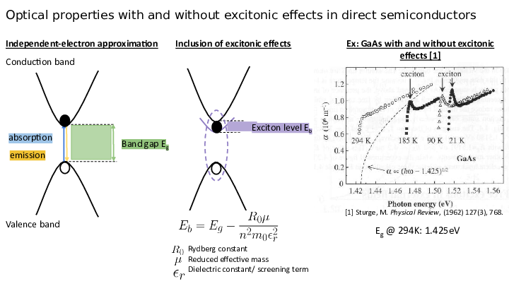

# camp_crew

A place to store all data and work during the SSMCDAT Hackathon, Jan 19-21, 2023

## The original problem

Solar cells create a current when a light particle (photon) strikes its surface, knocking an electron loose into an excited state, from the valence band (low energy, resting), to the conduction band (high energy, free to run amok through the material).

The energy between the conduction band and the valence band is called the bandgap energy, $E_g$, and is directly related to how energy efficient the solar cell is. There are simpler models to calculate the band gap energy, and more complicated but more accurate models to do so. We use the behavior of normal, silicon-based solar cells (indirect semiconductors), as the baseline model, but moving to more modern, advanced solar cells (direct semiconductors) requires understanding *excitonic* effects. In these more advanced solar cells, the band gap energy is reduced, allowing more photons of low energy to produce a current, generally increasing the efficiency of the solar cell.

Thus, in order to accurately estimate the efficiency of these new solar cells, we would like to estimate the band gap with these excitonic effects based on the chemical structure of the semiconductor! This new energy, $E_b$, is the exciton binding energy. We can use quantum-based calculations (density functional theory, a.k.a. DFT) to calculate these values accurately, but these calculations take a long time on the computer to run. Thus, if we can train lightweight machine learning models to bypass this DFT step, it would make designing efficient solar cells much easier!

## Our (original) approach

Originally, we found 3 databases contained tens of thousands of ABX3 materials (the class of materials we were interested in, hybrid organic-inorganic perovskites). We would use the descriptors above and train them with lightweight machine learning algorithms to compare what types of algorithms were best at calculating the exciton binding energy. We would also start to remove different descriptors as we trained to see what features were essential for accurately describing $E_b$.

## What we ended up doing

We found that a lot of these databases were difficult to deal with, especially given the time constraint of under 3 days to complete! We did also find another, far more helpful database (even with the added effort of extracting the data), and were able to salvage our efforts based on what was available. Thus, we scaled back our ambitions and used chemical structure as the main way to predict $E_b$, with 1,076 materials in the training dataset, and 270 materials in the test dataset.

### An aside on $\epsilon_r$
One key parameter that we couldn't calculate on our own to determine the ground truth values of $E_b$ was the dielectric constant ($\epsilon_r$), which comes in two flavors: ionic (associated with group IV cations, the B in ABX3) and electronic (associated with organic cations, the A in ABX3). This $\epsilon_r$ is not used consistently accross databases or reports and does affect results! We found that using electronic permittivity to calculate our ground truth $E_b$ was more accurate than the ionic permittivity.

This result may imply that the organic cations, which there are more of in literature, are more responsible for predicting $E_b$ than the inorganic cations, as the organic cations can rearrange in the material through rotation, leading to more exaggerated distortion of the electron cloud of the semiconductor lattice (see below for a depiction of electron cloud distortion).

## Summary
Over the course of the hackathon, we trained lightweight machine learning models to estimate the exciton band gap energy, a crucial parameter in estimating the efficiency of solar cell materials. With more time, we would have liked to compare the performance of more machine learning algorithms in predicting $E_b$ from chemical structure, and introduce other features such as formation energy, stability, ionic radii, etc. to see which data is most relevant. Furthermore, calculating the "ground truth" $E_b$ from reported $\epsilon_r$ values was nontrivial,  because of the lack of convergence of which $\epsilon_r$ to use. Thus, we hope future researchers, with more careful data reporting and database management, will make materials informatics approaches to calculating solar cell efficiency easier and more accurate.